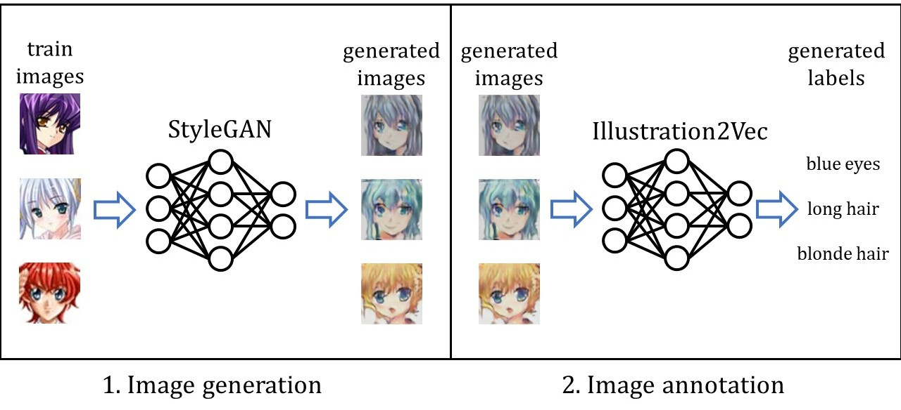
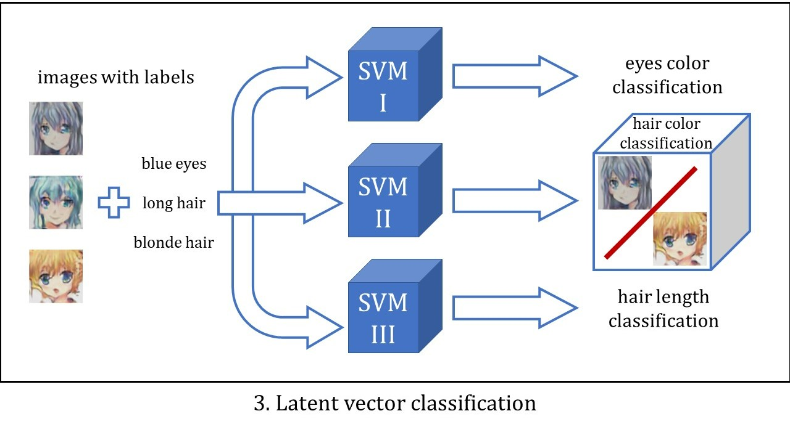
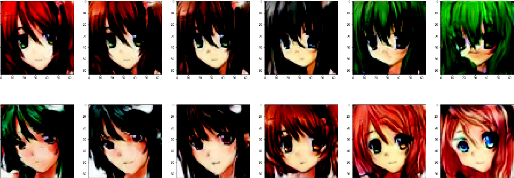
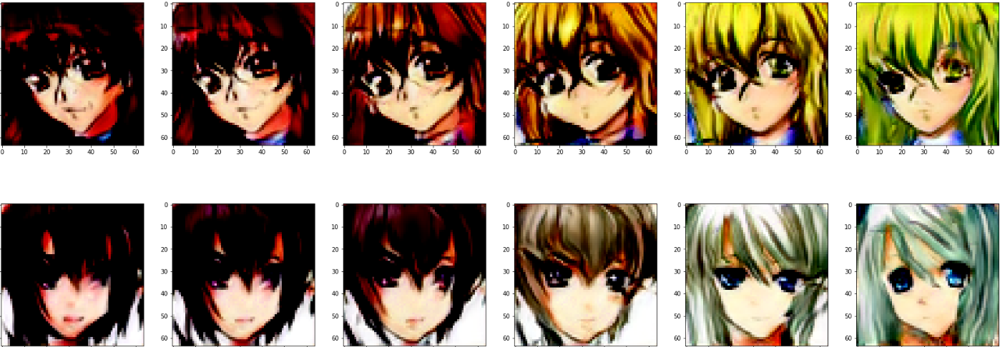
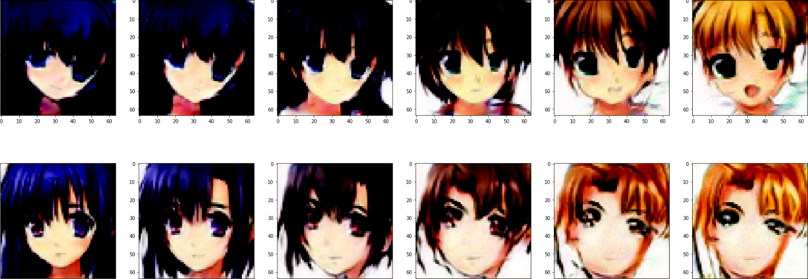

# :robot: Neural Face Editor (NFE) :art:

Neural Face Editor - create and edit anime images with power of GAN's and SoTA methods!

Team:
- Mikhail Rudakov, B19-DS, m.rudakov@innopolis.university
- Anna Startseva, B19-DS, a.startseva@innopolis.university
- Andrey Palaev, B19-DS, a.palaev@innopolis.university

## Table of Contents
- [Description](#description)
- [Demo](#demo)
- [Project Architecture](#project-architecture)
- [References](#references)

## Description
NFE is a tool that allows anyone to edit their anime pictures using Deep Learning to change attributes such as hair colour, hair length, eye colour etc.

The project is mainly inspired by works on interpreting the latent space of GANs for people face generation [1] and other methods of manipulating GAN output [2]. 
It leverages techniques mentioned in the papers to edit real users’ photos, change multiple image features, and preserve the general image content. 
These features for editing would probably include hair colour, eye colour, etc., which are not explored in the previous works.

## Demo
https://user-images.githubusercontent.com/66643655/204153747-7515023c-4b79-4aa3-b4e6-72e9ce785685.mp4

https://user-images.githubusercontent.com/66643655/204155710-8620c5ee-a8bb-4c03-bfc4-f6f1837d9db0.mp4

## Project Architecture

Mainly adopted from Shen et al. [1], our project architecture consists of several models.

Stage 1 is image generation. StyleGAN is used to produce images of anime faces.

Stage 2 is generated image annotation. We use [illustration2Vec](https://github.com/rezoo/illustration2vec) proposed by Saito and Matsui [2] to tag images with tags we need.

Stage 3 is image classification. For the each attribute we want to be able to control further, we train a SVM for separating latent codes based on some feature. This would let us know the vector in which this feature changes in the latent space.

## Results
Sample generated images, produced by GAN:  

### Image Manipulation
After getting separating hyperplanes, we implemented the way of attribute manipulation from [1]. Specifically, given the separating hyperplane n and the latent vector z, we generate several images using $z+an$, where `a=np.linspace(-3, 3, 6)`. Examples of image manipulation:
1. Making hair more (or less) green while keeping the hair length

2. Making hair more (or less) red without controlling the hair length

3. Changing the hair length preserving the hair colour

4. Changing the hair length without controlling the hair colour

As we can see, both usual and conditional manipulation work well. However, it is not successful for eyes since the labelled annotator performed bad on eye colour. As a result, separating hyperplanes for eye colour are very far from the true ones.

### GAN Inversion
Some preliminary results to access quality of GAN inversion:

### Telegram Bot
We also created telegram bot for our project, which is currently hosted on local computer and thus is not available 24/7. Alias: [@neural_face_editor_bot](https://t.me/neural_face_editor_bot)

This bot is intended to download anime faces photos from the users (or generate random ones) and allow to change some image attributes in the convenient telegram interface.

At this step, telegram bot uses trained StyleGAN to generate random anime faces. Intro message is available by `/help`*.* Send `/face` to try generating random images! (when bot would be online...)

Here are some examples of bot interaction:

 

## References
[1] Shen, Y., Gu, J., Tang, X., & Zhou, B. (2019). Interpreting the Latent Space of GANs for Semantic Face Editing. arXiv. https://doi.org/10.48550/arXiv.1907.10786  
[2] Upchurch, P., Gardner, J., Pleiss, G., Pless, R., Snavely, N., Bala, K., & Weinberger, K. (2016). Deep Feature Interpolation for Image Content Changes. arXiv. https://arxiv.org/abs/1611.05507v2
